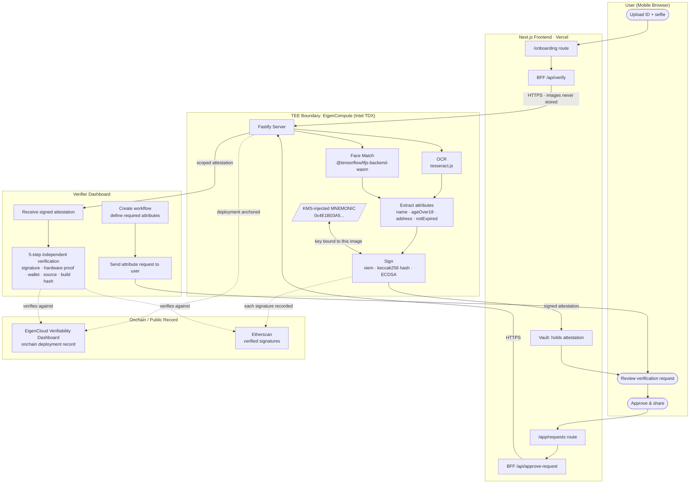

# Dokimos

Most identity verification works by having you upload your documents to a company's servers, which stores them to run checks on your behalf. That works, but it means your ID lives somewhere you don't control, and every company that verifies you holds a copy. Dokimos is built on a different premise: verify once inside secure hardware, then share cryptographic proof forever. Your documents never touch a company's servers. The business receiving your attestation never sees your ID. They see a signed statement from tamper-proof code that says you passed, and they can verify the signature themselves without trusting anyone, including us. That's the shift: from identity data as something a company stores on your behalf, to identity proof as something you control and selectively share.

---

## How it works

The system has two sides: a user who builds a vault of verified credentials, and a business that requests specific attributes from that vault. Everything in between (the document reading, the face comparison, the cryptographic signing) happens inside a Trusted Execution Environment running on EigenCompute's Intel TDX hardware, where neither the user nor the developer nor the business can see or alter the computation.

### The user flow

A user opens Dokimos on their phone and uploads a photo of their government ID along with a selfie. The frontend proxies both images to the TEE backend over HTTPS. Inside the enclave, tesseract.js reads the document text and extracts structured fields (name, date of birth, address, expiry date) while the TensorFlow.js WASM face matcher compares the ID photo to the selfie. Neither image ever leaves the TEE; what leaves is a JSON attestation containing the extracted attributes (name, ageOver18, address, notExpired), a face match result, a timestamp, and an ECDSA signature over a keccak256 hash of those exact fields. The signing key is a wallet derived from a mnemonic injected by EigenCloud's KMS at deploy time, bound to the specific Docker image. The attestation lands in the user's vault, where they hold it.

### The verifier flow

A business creates an account on the Dokimos verifier dashboard and defines a verification workflow, specifying which attributes they need, such as age confirmation and document validity. That workflow generates a request that the user receives in their app. The user reviews exactly what's being asked for, decides whether to approve, and if they do, the TEE generates a fresh attestation scoped to that specific request. The attestation is delivered to the verifier dashboard. From there, the business can run a five-step independent verification: check the ECDSA signature against the wallet address, inspect the TEE hardware proof, confirm the wallet against the onchain deployment record, review the source code on GitHub, and verify the Docker build hash. None of those steps require trusting Dokimos.

---

## Architecture



The TEE boundary is the key constraint: images go in, structured claims and a signature come out. Nothing else crosses.

---

## What's real vs. what's simulated

**Real and independently verifiable:**

The ECDSA signing is fully live. Every attestation Dokimos produces is signed by wallet `0x4E1B03A5678C52075A7271AfcF4c44e26f64ef35`, and those signatures are publicly visible on Etherscan. Any party holding an attestation can reconstruct the keccak256 hash of the claims, call `ecrecover`, and confirm the signer matches that address, with no Dokimos infrastructure required.

The KMS wallet is real. The mnemonic is injected by EigenCloud's key management system at deploy time and is bound to the specific Docker image hash. A different image produces a different wallet address. That binding is what makes the signing wallet a meaningful attestation: it's not just "some key we hold," it's a key that provably came from this code on this hardware.

The onchain deployment record is real. The EigenCompute app ID `0x00658E70d8880910277592b3B41F9dD3FE4Ce5Fd` is registered on Sepolia, and the EigenCloud Verifiability Dashboard shows the live deployment state against that record.

**What's simulated:**

The TEE quote fields in each attestation response (`mrenclave`, `tcbStatus`, and related Intel TDX fields) are structurally correct but contain simulated values. EigenCompute's platform doesn't yet expose the hardware-generated quote to applications running inside the enclave, so the code generates a well-formed placeholder and documents this explicitly in a `note` field on every attestation response. When the platform surface becomes available, replacing the simulated quote with a real one is the only code change needed. The signing, the OCR, and the face match are all running on real hardware today; the limitation is that the enclave can't yet reach back and ask the hardware to sign a quote of itself.

---

## Tech stack

- **Next.js 14 (App Router):** Mobile-first frontend: consumer vault, verifier dashboard, marketing, and NextAuth session management. BFF routes proxy to the TEE so raw endpoint URLs and server secrets never reach the browser.
- **Fastify:** TEE backend API. Handles OCR, face matching, signing, and in-memory user/verifier/request state. Deployed to EigenCompute on port 8080.
- **EigenCompute (Intel TDX via EigenCloud):** Confidential compute platform. The Docker image is deployed to a TDX enclave; the KMS injects the signing mnemonic at runtime, bound to that exact image hash.
- **viem:** Ethereum library for mnemonic-to-account derivation and ECDSA signing over keccak256 hashes. Also used in the frontend for attestation verification.
- **tesseract.js:** WASM-based OCR that reads structured text from ID document images inside the enclave.
- **@tensorflow/tfjs-backend-wasm:** TensorFlow.js running on WASM instead of native bindings. tfjs-node failed to build on the Alpine linux/amd64 target because of native module compilation constraints, so WASM is the production backend.
- **node-canvas:** Provides a Canvas API for Node.js so face-api can process images server-side without a browser.
- **Docker (Alpine, linux/amd64):** The enclave image. Alpine keeps the image small; the platform target is fixed to `linux/amd64` to match EigenCompute's runtime.
- **Vercel:** Hosts the Next.js frontend. `TEE_ENDPOINT` is set as a server-side environment variable pointing at the EigenCompute deployment.

---

## Running locally

You need two processes: the TEE backend and the Next.js app.

**1. TEE backend (repository root)**

```bash
# Install dependencies (node-canvas requires native build tools on macOS/Linux;
# on macOS: brew install pkg-config cairo pango libpng jpeg giflib librsvg)
npm install
npm run dev
```

The server starts on `http://localhost:8080`.

**2. Next.js app**

```bash
cd dokimos-app-v2
npm install
npm run dev
```

The app starts on `http://localhost:8081`.

**3. Environment setup**

Copy `.env.example` to `.env` in the repo root:

```bash
# Root .env (TEE backend)
MNEMONIC=              # leave blank or use a throwaway mnemonic; see note below
PORT=8080
CORS_ORIGINS=http://localhost:8081
```

Copy `dokimos-app-v2/.env.example` to `dokimos-app-v2/.env.local`:

```bash
TEE_ENDPOINT=http://localhost:8080
NEXTAUTH_URL=http://localhost:8081
NEXTAUTH_SECRET=       # generate with: openssl rand -base64 32
```

**A note on the signing wallet:** In the live deployment, the `MNEMONIC` is injected by EigenCloud's KMS and is cryptographically bound to the Docker image hash. Locally, you can supply any BIP-39 mnemonic and the backend will sign attestations with the derived wallet, but those signatures won't match the production address (`0x4E1B03A5...`) that appears on Etherscan, and the EigenCloud Verifiability Dashboard won't recognize the deployment. Local runs are useful for testing OCR, face matching, and the attestation structure, not for generating externally verifiable proofs.

**4. Docker (optional)**

To reproduce the exact production environment:

```bash
docker build --platform linux/amd64 -t dokimos-tee .
docker run -p 8080:8080 --env-file .env dokimos-tee
```

The Dockerfile installs the native Cairo stack headers needed by node-canvas; this is why Alpine is the base rather than a lighter image.

---

## Live deployment

**App ID:** `0x00658E70d8880910277592b3B41F9dD3FE4Ce5Fd`

**[EigenCloud Verifiability Dashboard](https://verify-sepolia.eigencloud.xyz/app/0x00658E70d8880910277592b3B41F9dD3FE4Ce5Fd):** Shows the onchain deployment record for this app ID on Sepolia, including the registered Docker image hash and the KMS-bound signing address. This is the root of trust a verifier uses to confirm that an attestation came from the right code on the right hardware.

**[Etherscan verified signatures](https://etherscan.io/verifiedSignatures?a=0x4E1B03A5678C52075A7271AfcF4c44e26f64ef35):** Public record of every attestation signature produced by the production deployment. Any party holding an attestation can reconstruct the signed hash and independently confirm the signer matches this address.

---

## Repository layout

| Path | Role |
|------|------|
| `src/index.ts` | Fastify TEE backend: OCR, face match, signing, in-memory state |
| `src/faceVerification.ts` | TensorFlow.js WASM face match pipeline |
| `dokimos-app-v2/` | Canonical Next.js app: consumer vault, verifier dashboard, BFF routes |
| `Dockerfile` | Production enclave image (linux/amd64, Alpine) |
| `dokimos-app-v2/docs/` | Demo scripts, PRD, verification flow documentation |
| `dokimos-app/` | Legacy prototype; not the active product surface |

---

## Security posture

This codebase is a working demonstration, not a production identity provider. The in-memory state store means verification records don't survive restarts. Before deploying to real users, you'd replace it with a persistent database, harden the NextAuth configuration, and wire up real Intel TDX quote generation once EigenCompute exposes that surface. See [SECURITY.md](./SECURITY.md) for the full hardening checklist.
